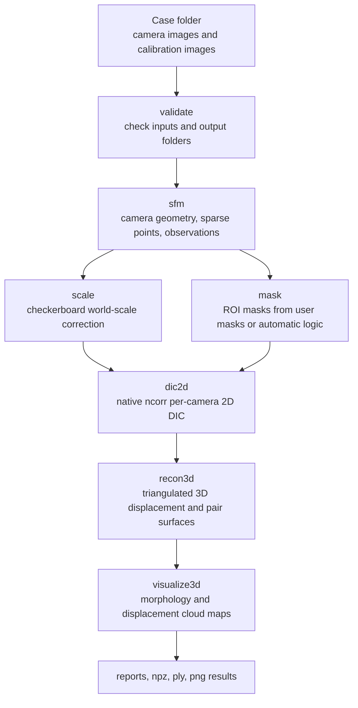

# PyMultiDIC

PyMultiDIC is a Python-first multi-view digital image correlation workflow. It
wraps the full solving process as public Python API calls under
`pymultidic.<function_name>` while keeping native C++ acceleration for the
expensive Ncorr-style 2D DIC, CPU-only COLMAP SfM, and 3D reconstruction
stages.

The project can be used in two ways:

- Install the released package with `pip install pymultidic` and call the API.
- Build the repository locally, including the native C++ components under
  `native/`, then run the same API from source.

The full user manual is available here:
[docs/pymultidic_usage_en.md](docs/pymultidic_usage_en.md).

## Example Results

The bundled `case/CylinderDIC` example was solved through the Python API. A
small set of representative result files is stored under
[docs/results/cylinderdic](docs/results/cylinderdic).

**3D morphology cloud map**


**Total 3D displacement cloud map**


**Displacement component cloud maps**

| Ux | Uy | Uz |
| --- | --- | --- |
|  |  |  |

Additional copied outputs:

- [docs/results/cylinderdic/sparse_scene.png](docs/results/cylinderdic/sparse_scene.png)
- [docs/results/cylinderdic/camera_observations_3d.png](docs/results/cylinderdic/camera_observations_3d.png)
- [docs/results/cylinderdic/recon3d_002.ply](docs/results/cylinderdic/recon3d_002.ply)
- [docs/results/cylinderdic/recon3d_report.json](docs/results/cylinderdic/recon3d_report.json)
- [docs/results/cylinderdic/pipeline_report.json](docs/results/cylinderdic/pipeline_report.json)

The example is regenerated from `run.py` using the native COLMAP ring matcher
and the `native_recon3d` backend. The current regenerated report registers all
12 cameras in one SfM model, exports 3606 sparse points, and reconstructs 3548
valid 3D displacement tracks for frame `002.bmp`.

## Install From PyPI

```bash
pip install pymultidic
```

Then call the package from Python:

```python
import pymultidic

config = pymultidic.load_config("configs/MDIC.yaml")
report = pymultidic.run_pipeline(
    config,
    steps=["validate", "sfm", "scale", "mask", "dic2d", "recon3d", "visualize3d"],
)
```

You can also call the API without a YAML file. In direct-input mode,
`case_root` is required and the remaining paths and numerical parameters use
PyMultiDIC defaults unless overridden:

```python
import pymultidic

report = pymultidic.run_pipeline(
    case_root="case/CylinderDIC",
    project_name="CylinderDIC",
    steps=["validate", "sfm", "scale", "mask", "dic2d", "recon3d", "visualize3d"],
    subset_radius=25,
    subset_spacing=6,
    min_corrcoef=0.6,
)
```

If an `MDICConfig` object is supplied, it is used as the base configuration.
Explicit keyword arguments still override matching fields for that call:

```python
config = pymultidic.load_config("configs/MDIC.yaml")
pymultidic.run_sfm(config, colmap_workspace="colmap_native")
```

## Local Native C++ Build

Use this route when developing the repository, changing files under `native/`,
or validating native builds before publishing wheels. The only supported local
source build path is the top-level [native/CMakeLists.txt](native/CMakeLists.txt)
entry point:

- `native_ncorr` / `libnative_ncorr.a`
- `ncorr_cli`
- `native_recon3d` pybind11 extension
- `native_colmap` pybind11 extension

WSL / Linux example:

```bash
sudo apt-get update
sudo apt-get install -y \
  build-essential cmake ninja-build python3-dev python3-pip \
  libboost-all-dev libeigen3-dev libceres-dev libflann-dev \
  libopenimageio-dev openimageio-tools libopencv-dev \
  libsqlite3-dev libgflags-dev libgoogle-glog-dev \
  libmetis-dev libsuitesparse-dev libglew-dev qtbase5-dev
python3 -m pip install -U pybind11 scikit-build-core

cmake -S native -B build/wsl-native -G Ninja \
  -DPYBIND11_FINDPYTHON=ON \
  -DPython_EXECUTABLE=/usr/bin/python3 \
  -Dpybind11_DIR=$(python3 -m pybind11 --cmakedir)
cmake --build build/wsl-native
```

Expected WSL/Linux outputs:

```text
build/wsl-native/ncorr/libnative_ncorr.a
build/wsl-native/ncorr/ncorr_cli
build/wsl-native/recon3d/native_recon3d*.so
build/wsl-native/colmap/native_colmap*.so
```

Windows example from a Developer PowerShell with CMake and Ninja available:

```powershell
python -m pip install -U pybind11 scikit-build-core cmake ninja
cmake -S native -B build/windows-native -G Ninja -DPYBIND11_FINDPYTHON=ON
cmake --build build/windows-native
```

Expected Windows outputs include:

```text
build/windows-native/ncorr/ncorr_cli.exe
build/windows-native/recon3d/native_recon3d*.pyd
build/windows-native/colmap/native_colmap*.pyd
```

After the native build, run the full example from the repository root:

```bash
python run.py --config configs/MDIC.yaml
```

`run.py` automatically prefers extensions from `build/wsl-native/colmap` and
`build/wsl-native/recon3d`, so stale editable installs do not shadow the current
checkout.

The default SfM backend is `native_colmap`. It embeds the required CPU-only
COLMAP code into a `native_colmap` pybind11 extension, so users do not need the
`pycolmap` Python API or a separately downloaded `colmap` executable. The
default matcher is `ring`, which imports a camera-order-aware pair list for the
multi-camera CylinderDIC layout instead of using exhaustive all-pairs matching.
This avoids unstable far-view matches on repeated speckle texture while still
using COLMAP SIFT extraction, geometric verification, and incremental mapping.

The embedded build uses the bundled COLMAP source tree in
`native/colmap/upstream` by default. To test a different upstream checkout, pass
`-DMDIC_COLMAP_SOURCE_DIR=/path/to/colmap`. If the extension is built without an
available source tree, the old external command runner is kept only as a
development fallback. Enable it explicitly with
`colmap.allow_external_executable: true`; otherwise `native_colmap` raises a
clear backend-unavailable error instead of silently requiring users to install
COLMAP. The previous `pycolmap` backend remains available as an optional
fallback with `pip install .[pycolmap]` and `colmap.backend: pycolmap`.
Model registration summaries and native backend capabilities are included in
`sfm_report.json`.

The maintained boundary is the narrow `native_colmap` API plus stable Multi-DIC
output files. Project-specific logic belongs in `native/colmap`; the upstream
COLMAP tree should stay structurally intact and be linked through
`native/colmap/upstream` or an explicit `MDIC_COLMAP_SOURCE_DIR`.

## Public API

Core API functions:

- `pymultidic.load_config(config_path, workspace_root=None)`
- `pymultidic.build_config(config=None, *, case_root=None, ...)`
- `pymultidic.validate_project(config=None, **kwargs)`
- `pymultidic.run_validate(config=None, **kwargs)`
- `pymultidic.run_sfm(config=None, **kwargs)`
- `pymultidic.run_scale(config=None, **kwargs)`
- `pymultidic.run_mask(config=None, **kwargs)`
- `pymultidic.run_dic2d(config=None, **kwargs)`
- `pymultidic.run_recon3d(config=None, **kwargs)`
- `pymultidic.run_visualize3d(config=None, **kwargs)`
- `pymultidic.run_step(config_or_step=None, step=None, **kwargs)`
- `pymultidic.run_pipeline(config=None, steps=None, stop_on_error=True, **kwargs)`

See [docs/pymultidic_usage_en.md](docs/pymultidic_usage_en.md) for the full
function-by-function parameter reference, return values, and examples.

## Workflow



Manual step-by-step control:

```python
import pymultidic

config = pymultidic.build_config(
    case_root="case/CylinderDIC",
    project_name="CylinderDIC",
    subset_radius=25,
    subset_spacing=6,
    min_corrcoef=0.6,
)

for step in ["validate", "sfm", "scale", "mask", "dic2d", "recon3d", "visualize3d"]:
    report = pymultidic.run_step(config, step)
    if not report.get("ok"):
        raise RuntimeError(f"{step} failed: {report}")
```

## Output Layout

By default, results are written under `<case_root>/<output_root>`. For the
bundled example this is `case/CylinderDIC/results`.

Common output folders:

- `logs/`: JSON reports for each step and the full pipeline.
- `sfm/colmap/`: camera models, sparse points, observations, and COLMAP files.
- `scale/`: checkerboard scale correction outputs.
- `masks/`: ROI masks, overlays, and debug images.
- `dic2d/`: per-camera/per-frame DIC2D `.npz` outputs.
- `recon3d/`: global 3D reconstruction `.npz` and `.ply` files.
- `recon3d/pairs/<frame>/`: MultiDIC-style pair surface meshes.
- `recon3d/post/<frame>/`: pair-surface post-processing results.
- `figures/`: 3D visualization outputs.
- `figures/surface_clouds/`: morphology, total displacement, and Ux/Uy/Uz
  cloud maps.

Programmatic access to visualization outputs:

```python
vis_report = pymultidic.run_visualize3d(config)
outputs = vis_report["outputs"]

print(outputs["surface_cloud_morphology"])
print(outputs["surface_cloud_displacement_total"])
print(outputs["surface_cloud_displacement_ux"])
print(outputs["surface_cloud_displacement_uy"])
print(outputs["surface_cloud_displacement_uz"])
```

## Reference Source

`reference_code_lib/` is kept as local reference source code. The formal
PyMultiDIC implementation lives in the repository root, the `pymultidic/`
package, the `multidic/` implementation modules, and the native C++ projects
under `native/`.
