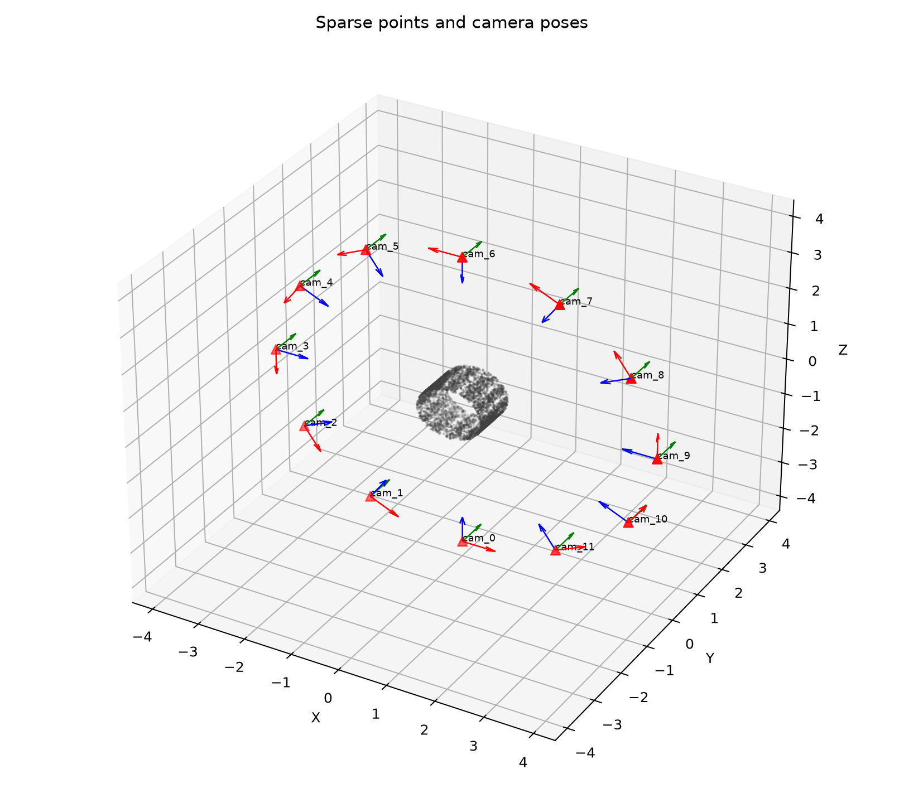
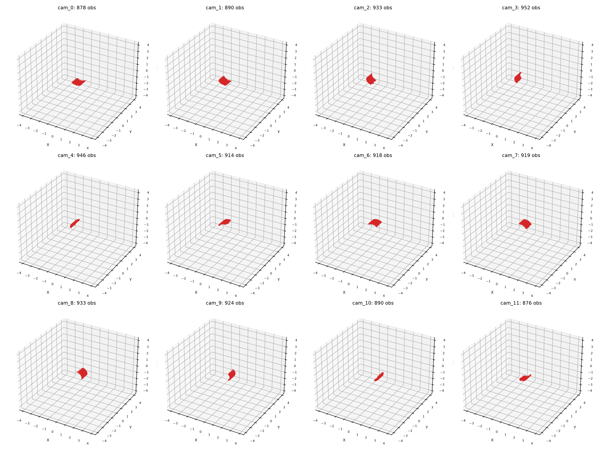
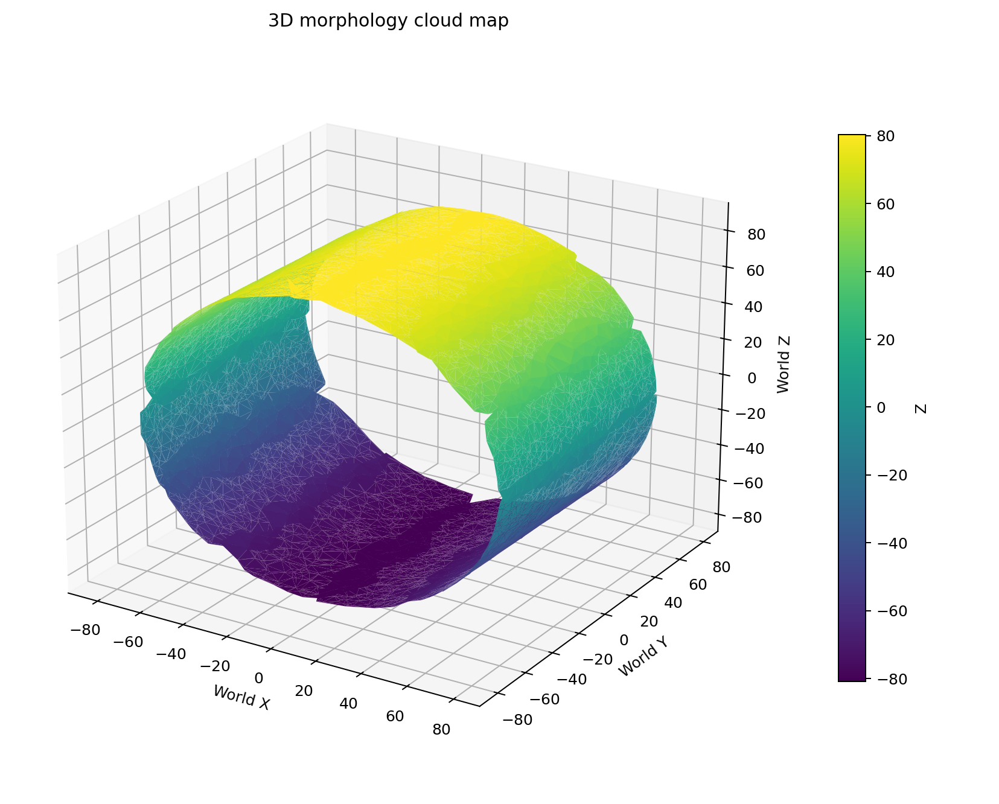
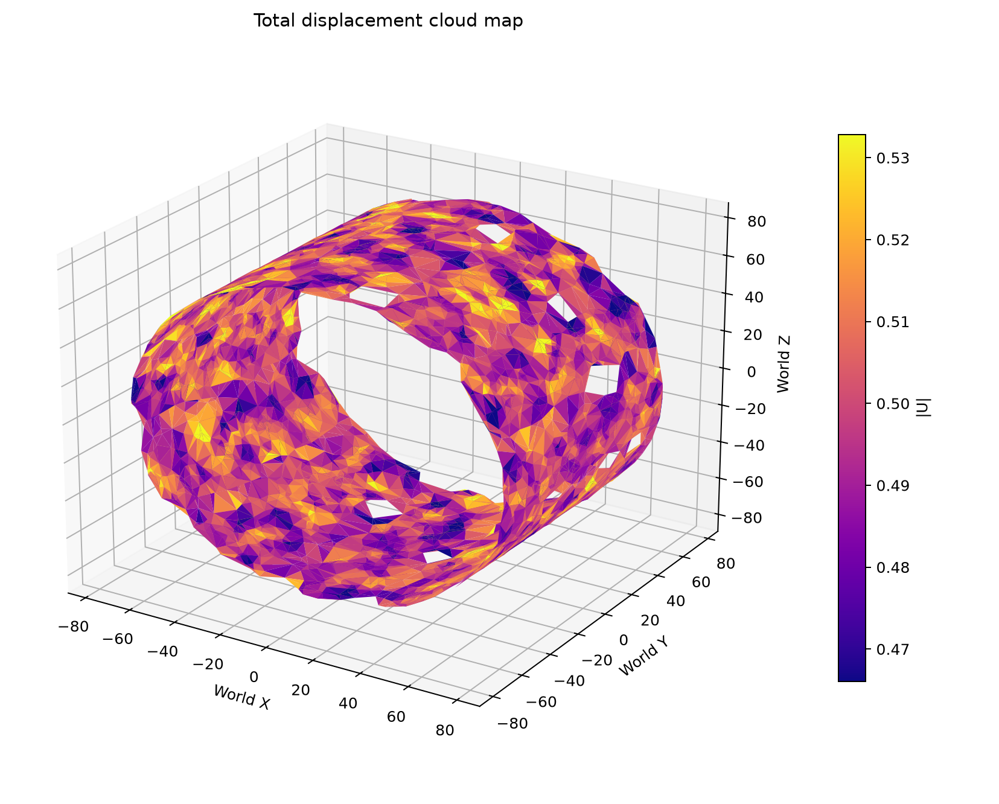
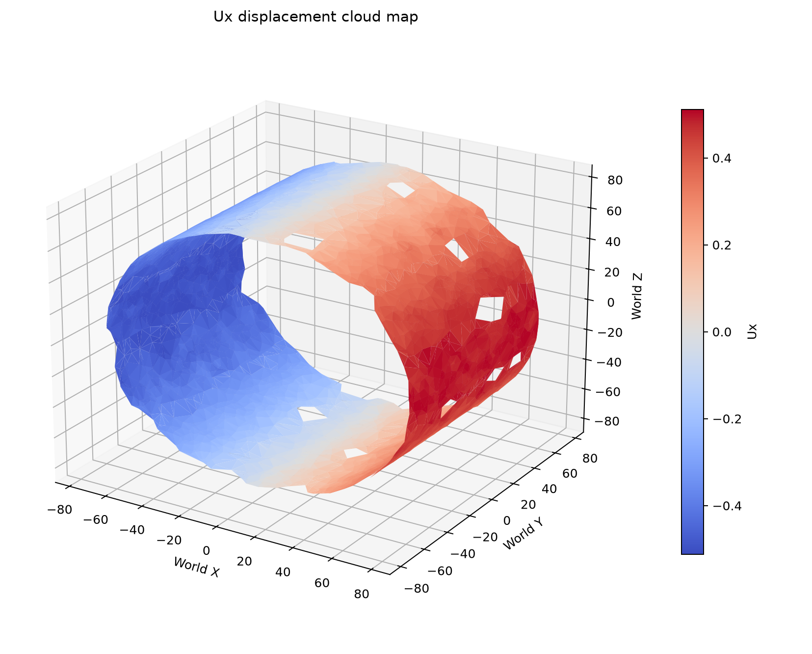
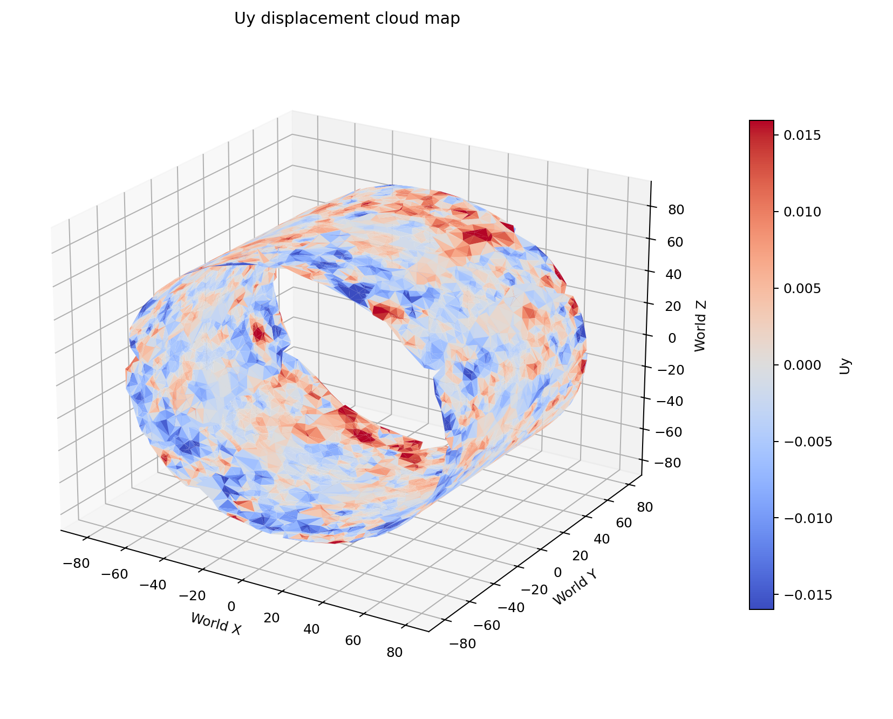
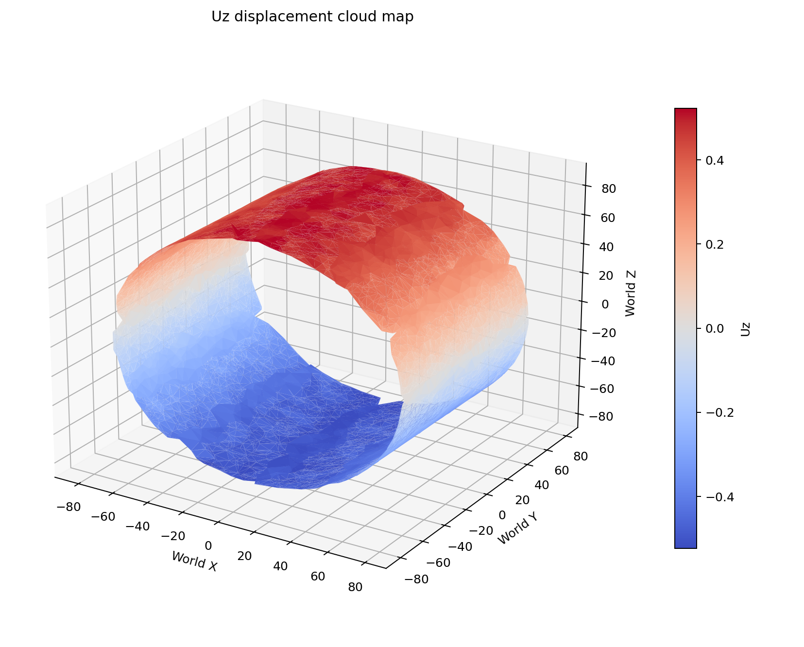
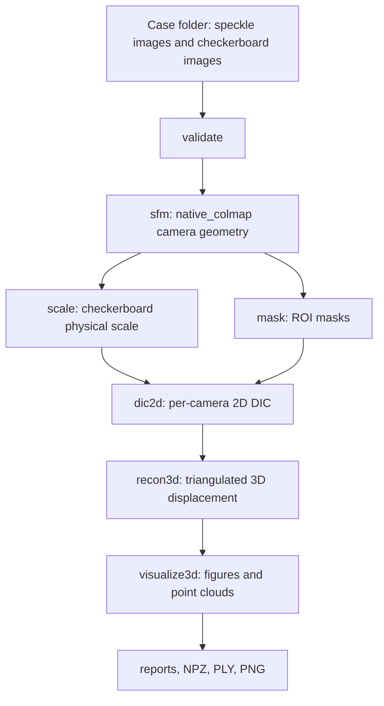
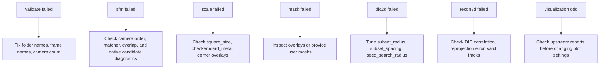

# PyMultiDIC User Guide

PyMultiDIC is a Python-first multi-view digital image correlation workflow. It
wraps camera geometry estimation, scale correction, ROI preparation, 2D DIC, 3D
reconstruction, and visualization behind a small Python API while keeping the
heavy numerical stages in native C++ modules.

This guide is the Markdown source version of the user manual. It is written for
two audiences:

- Users who install the package and run real experiments.
- Developers who build the native modules locally and extend the workflow.

## Table Of Contents

- [Quick Start](#quick-start)
- [Chapter 1. Project Scope And Implementation](#chapter-1-project-scope-and-implementation)
  - [1.1 What This Project Does](#11-what-this-project-does)
  - [1.2 Real Experiment Assumptions](#12-real-experiment-assumptions)
  - [1.3 Main Implementation Plan](#13-main-implementation-plan)
  - [1.4 Native Backends](#14-native-backends)
- [Chapter 2. Installation](#chapter-2-installation)
  - [2.1 Choose Package Mode Or Source Mode](#21-choose-package-mode-or-source-mode)
  - [2.2 Install With pip](#22-install-with-pip)
  - [2.3 Local Source Build On Windows](#23-local-source-build-on-windows)
  - [2.4 Local Source Build On Linux Or WSL](#24-local-source-build-on-linux-or-wsl)
  - [2.5 Local Source Build On macOS](#25-local-source-build-on-macos)
  - [2.6 Conda Environment](#26-conda-environment)
  - [2.7 Verify The Installation](#27-verify-the-installation)
- [Chapter 3. Running The Full Workflow](#chapter-3-running-the-full-workflow)
  - [3.1 Real Experiment Directory Layout](#31-real-experiment-directory-layout)
  - [3.2 Run The Whole Pipeline](#32-run-the-whole-pipeline)
  - [3.3 Module 1: validate](#33-module-1-validate)
  - [3.4 Module 2: sfm](#34-module-2-sfm)
  - [3.5 Module 3: scale](#35-module-3-scale)
  - [3.6 Module 4: mask](#36-module-4-mask)
  - [3.7 Module 5: dic2d](#37-module-5-dic2d)
  - [3.8 Module 6: recon3d](#38-module-6-recon3d)
  - [3.9 Module 7: visualize3d](#39-module-7-visualize3d)
  - [3.10 Example Results](#310-example-results)
- [Chapter 4. API Functions And Configuration Parameters](#chapter-4-api-functions-and-configuration-parameters)
  - [4.1 Two Calling Styles](#41-two-calling-styles)
  - [4.2 API Function Overview](#42-api-function-overview)
  - [4.3 Config Parameter Reference](#43-config-parameter-reference)
  - [4.4 Explicit Function Argument Reference](#44-explicit-function-argument-reference)
- [Chapter 5. Workflow Graphs And Pseudocode](#chapter-5-workflow-graphs-and-pseudocode)
  - [5.1 Module Flowchart](#51-module-flowchart)
  - [5.2 Stepwise Debug Flow](#52-stepwise-debug-flow)
  - [5.3 Pseudocode: Config Driven Pipeline](#53-pseudocode-config-driven-pipeline)
  - [5.4 Pseudocode: Explicit Argument Pipeline](#54-pseudocode-explicit-argument-pipeline)
- [Chapter 6. Acknowledgements And Project Boundary](#chapter-6-acknowledgements-and-project-boundary)

## Quick Start

For normal users, start with the package installation:

```bash
python -m pip install -U pymultidic
```

PyMultiDIC 2.x provides binary wheels for CPython 3.12 on Windows x86_64 and
Linux x86_64. A supported wheel includes `native_colmap`, `native_recon3d`, and
`ncorr_cli`; no local compiler is required. Other Python versions and macOS do
not currently have supported binary wheels.

Run a YAML-configured workflow:

```bash
python run.py --config configs/MDIC.yaml
```

Or call the Python API:

```python
import pymultidic

config = pymultidic.load_config("configs/MDIC.yaml")
report = pymultidic.run_pipeline(
    config,
    steps=["validate", "sfm", "scale", "mask", "dic2d", "recon3d", "visualize3d"],
)
print(report["ok"])
```

If you installed a working wheel from PyPI and you are not editing native source
code, you do not need a local C++ compiler or CMake.

## Chapter 1. Project Scope And Implementation

### 1.1 What This Project Does

PyMultiDIC provides a complete, scriptable workflow for multi-camera digital
image correlation. Given reference speckle images, deformed speckle images, and
checkerboard calibration images, it produces:

- Input validation reports.
- Sparse camera geometry and point observations from SfM.
- A physical scale correction from checkerboard images.
- Per-camera ROI masks.
- Per-camera 2D DIC displacement fields.
- 3D displacement reconstructions.
- Visualization figures, JSON reports, NPZ arrays, and PLY point clouds.

The project is intended to make the workflow usable from Python without asking
users to manually operate several separate tools. The public API is exposed as
`pymultidic.<function_name>`.

### 1.2 Real Experiment Assumptions

Real experiment folders usually do not contain ground truth. A practical case
only needs:

- Speckle images captured by each camera.
- Checkerboard calibration images captured by each camera.
- A YAML config or equivalent explicit Python arguments.

The `ground_truth/` folder is not required for real experiments. When no ground
truth exists, evaluate results by internal consistency:

- Whether all expected cameras are detected and registered.
- Whether SfM reprojection error is reasonable.
- Whether checkerboard scale correction is stable.
- Whether ROI masks match the specimen.
- Whether 2D DIC correlation is high enough.
- Whether 3D reprojection error and valid track ratios are acceptable.
- Whether morphology and displacement visualizations are spatially coherent.

Do not claim absolute accuracy from plots alone when no ground truth is
available. A better statement is: "The result is internally consistent under the
current SfM, scale, DIC, and reprojection checks."

### 1.3 Main Implementation Plan

The implementation follows a staged design:

1. `validate`: inspect the case folder, cameras, frames, and output folders.
2. `sfm`: estimate camera geometry and sparse 3D observations.
3. `scale`: compute a world-scale correction from checkerboard images.
4. `mask`: create or load per-camera ROI masks.
5. `dic2d`: run native Ncorr-style 2D DIC per camera.
6. `recon3d`: triangulate 3D displacement from 2D DIC and SfM observations.
7. `visualize3d`: create figures and point-cloud products for review.

Each stage writes its own report under `results/logs/`. The full workflow writes
`results/logs/pipeline_report.json`.

### 1.4 Native Backends

PyMultiDIC keeps the Python API small and uses native C++ for expensive stages:

- `native_colmap`: CPU-only embedded COLMAP SfM adapter.
- `ncorr_cli`: native Ncorr-style 2D DIC command-line backend.
- `native_recon3d`: native 3D reconstruction extension.

The supported local native build entry point is `native/CMakeLists.txt`. The
normal package user should not need to compile these locally if a wheel is
available for the platform.

`native_colmap` is the only SfM implementation. It keeps the required COLMAP
CPU sparse source under `native/colmap/src`, exposes a narrow pybind11 API, and
does not call an external `colmap.exe` at runtime. The embedded mapper runs the
trimmed COLMAP CorrespondenceGraph, IncrementalMapper, IncrementalTriangulator,
and local/global Ceres bundle-adjustment code. It tries multiple initial image
pairs, scores candidate models by registration completeness, per-camera
observations, camera-center outliers, reprojection error, and 2D coverage, then
exports the selected model.

## Chapter 2. Installation

### 2.1 Choose Package Mode Or Source Mode

Use package mode when:

- You only want to run Multi-DIC on experiment data.
- You installed with `pip install pymultidic`.
- You are not editing files under `native/`.
- The installed package imports and runs successfully.

Use source mode when:

- You cloned the repository and want to run from the checkout.
- You changed native C++ code under `native/`.
- Your platform does not have a usable prebuilt wheel.
- You are testing wheel/build behavior before release.
- `native_colmap`, `native_recon3d`, or `ncorr_cli` is missing from the local
  checkout.

### 2.2 Install With pip

Package users should try this first:

```bash
python -m pip install -U pymultidic
```

Verify:

```bash
python -c "import pymultidic; print(pymultidic.__version__)"
```

If the wheel includes the native modules for your platform, no local C++
compiler setup is required. You should not need:

- A local `native/` build.
- CMake or Ninja.

If the platform has no wheel and pip falls back to building from source, you
will need the source-build dependencies described below.

### 2.3 Local Source Build On Windows

Use this route only for development or when a wheel is not available.

Prerequisites:

- Python 3.12.
- Visual Studio Build Tools or a Developer PowerShell with a C++ compiler.
- CMake and Ninja.

Commands:

```powershell
python -m pip install -U pybind11 scikit-build-core cmake ninja
cmake -S native -B build/windows-native -G Ninja -DPYBIND11_FINDPYTHON=ON
cmake --build build/windows-native
```

The validated Windows COLMAP source-port build on this checkout uses a
dedicated `build/native-colmap-port` tree and the project-local Visual Studio
Build Tools:

```powershell
cmd /c ""C:\01project\ncorr\.tools\vsbt\VC\Auxiliary\Build\vcvars64.bat" >nul && python -m cmake -S native -B build\native-colmap-port -G Ninja -DCMAKE_MAKE_PROGRAM=C:\Users\LBD\AppData\Roaming\Python\Python313\Scripts\ninja.exe -DCMAKE_BUILD_TYPE=Release -DPYBIND11_FINDPYTHON=OFF -Dpybind11_DIR=C:\Users\LBD\AppData\Roaming\Python\Python313\site-packages\pybind11\share\cmake\pybind11"
cmd /c ""C:\01project\ncorr\.tools\vsbt\VC\Auxiliary\Build\vcvars64.bat" >nul && C:\Users\LBD\AppData\Roaming\Python\Python313\Scripts\ninja.exe -C build\native-colmap-port native_colmap -j 2"
```

Expected outputs:

```text
build/windows-native/ncorr/ncorr_cli.exe
build/windows-native/recon3d/native_recon3d*.pyd
build/windows-native/colmap/native_colmap*.pyd
build/native-colmap-port/colmap/native_colmap*.pyd
build/native-colmap-port/colmap/mdic_colmap_sparse.lib
```

If CMake cannot find a compiler, run from a Developer PowerShell or install the
Visual Studio Build Tools C++ workload.

### 2.4 Local Source Build On Linux Or WSL

WSL/Linux is recommended for native development because the CPU COLMAP
dependencies are easier to install.

Install dependencies on Ubuntu or Debian:

```bash
sudo apt-get update
sudo apt-get install -y \
  build-essential cmake ninja-build python3-dev python3-pip python3-venv \
  libboost-graph-dev libeigen3-dev libceres-dev \
  libsqlite3-dev libgoogle-glog-dev libsuitesparse-dev

python3 -m venv .venv
. .venv/bin/activate
python -m pip install -U pybind11 scikit-build-core
```

Build:

```bash
cmake -S native -B build/wsl-native -G Ninja \
  -DPYBIND11_FINDPYTHON=ON \
  -DPython_EXECUTABLE=$(which python) \
  -Dpybind11_DIR=$(python -m pybind11 --cmakedir)
cmake --build build/wsl-native -j2
```

Expected outputs:

```text
build/wsl-native/ncorr/ncorr_cli
build/wsl-native/recon3d/native_recon3d*.so
build/wsl-native/colmap/native_colmap*.so
```

From Windows PowerShell calling WSL:

```powershell
wsl -e bash -lc "cd /mnt/c/01project/Multi-DIC && cmake -S native -B build/wsl-native -GNinja -DPYBIND11_FINDPYTHON=ON -DPython_EXECUTABLE=/usr/bin/python3 -Dpybind11_DIR=$(python3 -m pybind11 --cmakedir) && cmake --build build/wsl-native -j2"
```

### 2.5 Local Source Build On macOS

macOS source builds follow the same `native/CMakeLists.txt` path, but dependency
availability can vary by processor and package manager.

Install common dependencies with Homebrew:

```bash
brew install cmake ninja pybind11 boost eigen ceres-solver flann openimageio opencv sqlite gflags glog suite-sparse glew qt
python3 -m pip install -U scikit-build-core pybind11
```

Build:

```bash
cmake -S native -B build/macos-native -G Ninja \
  -DPYBIND11_FINDPYTHON=ON \
  -Dpybind11_DIR=$(python3 -m pybind11 --cmakedir)
cmake --build build/macos-native -j2
```

Expected outputs:

```text
build/macos-native/ncorr/ncorr_cli
build/macos-native/recon3d/native_recon3d*.so
build/macos-native/colmap/native_colmap*.so
```

If a dependency cannot be found, prefer fixing the CMake package path rather
than changing the source tree. For normal use, prefer the pip wheel if it is
available for your macOS version and architecture.

### 2.6 Conda Environment

The repository includes `environment.yml` for conda-forge based development:

```bash
mamba env create -f environment.yml
mamba activate multi-dic
```

Then run the platform-specific native build command. Conda is useful when system
packages are not available or when you need a reproducible development
environment.

### 2.7 Verify The Installation

For package mode:

```bash
python -c "import pymultidic; print('pymultidic import ok')"
```

For source mode after a WSL/Linux build:

```bash
python - <<'PY'
import sys
sys.path[:0] = ["build/wsl-native/colmap", "build/wsl-native/recon3d"]
import native_colmap
import native_recon3d
print(native_colmap.capabilities())
print("native_recon3d import ok")
PY
```

If running through `run.py`, the script automatically prefers local native build
folders such as `build/wsl-native/colmap`, `build/wsl-native/recon3d`,
`build/windows-native/colmap`, `build/windows-native/recon3d`, and
`build/native-colmap-port/colmap`. This keeps stale editable installs from
shadowing the extension that was just built.

## Chapter 3. Running The Full Workflow

### 3.1 Real Experiment Directory Layout

A real experiment does not need truth data. The minimum case layout is:

```text
case/MyExperiment/
  images/
    cam_0/
      001.bmp
      002.bmp
    cam_1/
      001.bmp
      002.bmp
    ...
  calibrate_images/
    chessboard_meta.json
    cam_0/
      001.bmp
    cam_1/
      001.bmp
    ...
```

The default meaning is:

- `001.bmp`: reference speckle frame.
- `002.bmp` and later frames: deformed speckle frames.
- `images/cam_*`: per-camera speckle images.
- `calibrate_images/cam_*`: per-camera checkerboard images.
- `calibrate_images/chessboard_meta.json`: checkerboard metadata.
- `results/`: generated output folder.

Camera folder names should follow the physical camera order when using the
optional `ring` matcher. For a circular camera rig, `cam_0`, `cam_1`, ...,
`cam_N` should follow the ring order.

### 3.2 Run The Whole Pipeline

With a YAML config:

```bash
python run.py --config configs/MDIC.yaml
```

With selected steps:

```bash
python run.py --config configs/MDIC.yaml --steps validate sfm scale
```

With Python:

```python
import pymultidic

config = pymultidic.load_config("configs/MDIC.yaml")
report = pymultidic.run_pipeline(
    config,
    steps=["validate", "sfm", "scale", "mask", "dic2d", "recon3d", "visualize3d"],
)
```

The default full order is:

```text
validate -> sfm -> scale -> mask -> dic2d -> recon3d -> visualize3d
```

### 3.3 Module 1: validate

Goal:

Validate the case folder, camera folders, image names, image sizes, and output
directories.

Run:

```python
config = pymultidic.load_config("configs/MDIC.yaml")
report = pymultidic.run_validate(config)
```

Main outputs:

```text
results/logs/validation_report.json
```

What to check without ground truth:

- `ok` is `true`.
- `camera_count` matches the expected number of cameras.
- Every camera has the reference frame and deformed frames.
- Image sizes are consistent.
- Output directories are created.

### 3.4 Module 2: sfm

Goal:

Estimate sparse camera geometry and reference-frame sparse observations using
the configured SfM backend.

Run:

```python
report = pymultidic.run_sfm(config)
```

Main outputs:

```text
results/logs/sfm_report.json
results/sfm/colmap/cameras.npz
results/sfm/colmap/cameras.json
results/sfm/colmap/sparse_points.npz
results/sfm/colmap/observations.npz
results/sfm/colmap/sparse_scene.png
results/sfm/colmap/camera_observations_2d.png
results/sfm/colmap/camera_observations_3d.png
results/sfm/colmap/sparse_point_filter.json
```

Example SfM visualizations:





What to check without ground truth:

- `backend` is `native_colmap`.
- `native_colmap_backend` is `embedded_colmap_sparse_source`.
- `native_colmap_capabilities.implementation` is
  `colmap_sparse_source_port`.
- `native_colmap_steps` includes feature extraction, verified matching,
  multi-initial-pair incremental mapping, sparse global BA, and text-model
  export.
- All configured cameras are registered in one selected model.
- `missing_cameras` is empty.
- Each camera has reasonable 2D observation coverage, not zero or single-digit
  observations.
- Mean reprojection error is reasonable for the image resolution.
- `sparse_point_filter.json` reports 3D sparse-point outlier removal before
  the exported observations and figures are generated.

Common fixes:

- Keep `matcher: exhaustive` for the 12-camera cylinder case when accuracy is
  the priority; the sparse source port benefits from multi-view tracks.
- Inspect native candidate diagnostics when a camera fails registration or has
  weak observations.
- Increase `max_features` if rich speckle texture still produces sparse
  matches.
- Check `camera_observations_2d.png` for broad per-camera red-point coverage.
- Check `sparse_scene.png` for one continuous camera rig with no flying camera
  center.

### 3.5 Module 3: scale

Goal:

Estimate a physical scale factor from checkerboard calibration images so that
the SfM coordinate system can be converted to physical units.

Run:

```python
report = pymultidic.run_scale(config)
```

Main outputs:

```text
results/logs/scale_report.json
results/scale/sfm2world_scale.json
results/scale/chessboard_triangulation.npz
results/scale/detections/*_corners.png
```

What to check without ground truth:

- Enough cameras detect the checkerboard.
- Enough common corners are triangulated.
- Reprojection error is low.
- The edge coefficient of variation is small.
- `sfm_to_world_scale` is positive and plausible.

Common fixes:

- Verify `scale_correction.square_size` and `square_size_unit`.
- Inspect `results/scale/detections/*_corners.png`.
- Check that `chessboard_meta.json` matches the real checkerboard.
- Remove unusable calibration images or improve checkerboard visibility.

### 3.6 Module 4: mask

Goal:

Create or load ROI masks for each camera. Masks limit DIC to the specimen
region.

Run:

```python
report = pymultidic.run_mask(config)
```

Main outputs:

```text
results/logs/mask_report.json
results/masks/auto_roi_summary.png
results/masks/mask/*_mask.png
results/masks/overlay/*_overlay.png
results/masks/debug/
```

What to check without ground truth:

- The ROI covers the speckled specimen.
- Important specimen regions are not cut away.
- Background is mostly excluded.
- Overlays align with the camera images.

Common fixes:

- Provide user masks under `case/<name>/masks`.
- Keep `mask.use_user_mask_if_present: true`.
- Adjust threshold and hole-filling settings only after viewing overlays.

### 3.7 Module 5: dic2d

Goal:

Run per-camera 2D DIC between the reference frame and each deformed frame.

Run:

```python
report = pymultidic.run_dic2d(config)
```

Main outputs:

```text
results/logs/dic2d_report.json
results/dic2d/dic2d_<camera>_<frame>.npz
```

What to check without ground truth:

- Every camera and deformed frame has an output file.
- Correlation coefficients are mostly above the cutoff.
- Valid DIC points follow the ROI instead of random islands.
- Displacement directions are plausible for the loading condition.

Common fixes:

- Increase `dic2d.subset_radius` for noisy or low-texture images.
- Increase `dic2d.seed_search_radius` for large frame-to-frame displacement.
- Use a larger `dic2d.subset_spacing` for a faster diagnostic run.
- Lower `dic2d.format.cutoff_corrcoef` only after visual inspection supports it.

### 3.8 Module 6: recon3d

Goal:

Triangulate 3D displacement from 2D DIC outputs, SfM observations, and scale
correction.

Run:

```python
report = pymultidic.run_recon3d(config)
```

Main outputs:

```text
results/logs/recon3d_report.json
results/recon3d/recon3d_<frame>.npz
results/recon3d/recon3d_<frame>.ply
results/recon3d/qc/<frame>/
```

What to check without ground truth:

- `num_tracks_valid / num_tracks_total` is high.
- Mean number of views is at least near 2 and preferably higher.
- Reference and deformed reprojection errors are low.
- Camera contributions are not dominated by one camera.
- Outlier filtering removes only a small fraction unless the data is noisy.

Example output:

- [recon3d_002.ply](results/cylinderdic/recon3d_002.ply)
- [recon3d_report.json](results/cylinderdic/recon3d_report.json)

### 3.9 Module 7: visualize3d

Goal:

Generate visual reports from reconstructed 3D morphology and displacement
fields.

Run:

```python
report = pymultidic.run_visualize3d(config)
```

Main outputs:

```text
results/figures/002_initial_shape_points.png
results/figures/002_initial_shape_surface.png
results/figures/002_surface_fields.png
results/figures/002_displacement_components.png
results/figures/surface_clouds/*.png
results/figures/002_reference_points.ply
results/figures/002_surface_fields.npz
```

What to check without ground truth:

- The morphology resembles the specimen.
- Displacement fields are spatially coherent.
- Component maps have plausible directionality.
- No isolated high-magnitude islands dominate the color scale.

### 3.10 Example Results

The current `CylinderDIC` example was regenerated with:

```text
validate, sfm, scale, mask, dic2d, recon3d, visualize3d
```

Summary:

| Metric | Value |
| --- | --- |
| SfM backend | embedded `native_colmap` sparse source port |
| Native backend | `embedded_colmap_sparse_source` |
| COLMAP implementation | `colmap_sparse_source_port` |
| Matcher | `exhaustive` |
| Registered cameras | 12 / 12 |
| Native sparse points | 14403 |
| Exported sparse points after 3D outlier cleaning | 14367 |
| Mean SfM reprojection error | 0.109651 px |
| Valid 3D points | 12926 / 14367 |
| Median displacement norm | 0.5081374654088713 |

3D morphology:



Total displacement:



Displacement components:

| Ux | Uy | Uz |
| --- | --- | --- |
|  |  |  |

Full copied reports:

- [pipeline_report.json](results/cylinderdic/pipeline_report.json)
- [recon3d_report.json](results/cylinderdic/recon3d_report.json)

## Chapter 4. API Functions And Configuration Parameters

### 4.1 Two Calling Styles

PyMultiDIC supports two equivalent calling styles.

Config-driven mode:

```python
import pymultidic

config = pymultidic.load_config("configs/MDIC.yaml")
report = pymultidic.run_sfm(config)
```

In config-driven mode, the `MDICConfig` object supplies the case paths,
algorithm settings, and output settings. You usually do not need to pass
explicit keyword arguments after that.

Explicit-argument mode:

```python
import pymultidic

report = pymultidic.run_pipeline(
    config=None,
    case_root="case/CylinderDIC",
    project_name="CylinderDIC",
    deformed_frames=["002.bmp"],
    subset_radius=20,
    subset_spacing=5,
    min_corrcoef=0.6,
)
```

If `config=None`, `case_root` is required. Other arguments use PyMultiDIC
defaults unless explicitly provided.

Mixed mode:

```python
config = pymultidic.load_config("configs/MDIC.yaml")
report = pymultidic.run_sfm(config, matching_window=3)
```

If both a config object and explicit keyword arguments are supplied, the config
is used as the base and explicit keyword arguments override matching fields for
that call only.

### 4.2 API Function Overview

| Function | Goal | Config-driven | Explicit arguments | Main output |
| --- | --- | --- | --- | --- |
| `load_config` | Load YAML into `MDICConfig` | N/A | `config_path`, `workspace_root` | `MDICConfig` |
| `build_config` | Build or override config from Python inputs | yes | yes | `MDICConfig` |
| `validate_project` | Check case layout | yes | yes | validation report dict |
| `run_validate` | Alias for validation | yes | yes | validation report dict |
| `run_sfm` | Camera SfM and sparse observations | yes | yes | sfm report dict |
| `run_scale` | Checkerboard scale correction | yes | yes | scale report dict |
| `run_mask` | Generate or load ROI masks | yes | yes | mask report dict |
| `run_dic2d` | 2D DIC for every camera | yes | yes | dic2d report dict |
| `run_recon3d` | 3D reconstruction | yes | yes | recon3d report dict |
| `run_visualize3d` | Figures and visual products | yes | yes | visualize3d report dict |
| `run_step` | Run one named step | yes | yes | step report dict |
| `run_pipeline` | Run an ordered workflow | yes | yes | pipeline report dict |

### 4.3 Config Parameter Reference

The YAML config is the recommended interface for real experiments because it
keeps parameters reproducible.

Commonly modified fields:

| Field | Why users modify it |
| --- | --- |
| `project.name` | Name shown in reports. |
| `project.case_root` | Experiment folder. |
| `data.reference_frame` | Reference speckle frame name. |
| `data.deformed_frames` | Deformed frame names. |
| `scale_correction.square_size` | Physical checkerboard square size. |
| `scale_correction.square_size_unit` | Physical unit, such as `mm`. |
| `colmap.matching_window` | Neighbor range when using windowed ring matching. |
| `dic2d.subset_radius` | DIC subset radius. |
| `dic2d.subset_spacing` | DIC point spacing. |
| `dic2d.seed_search_radius` | Search range for large displacement. |
| `recon3d.min_corrcoef` | Minimum DIC correlation for 3D use. |
| `recon3d.max_reprojection_error_px` | 3D reprojection error filter. |

Less commonly modified fields:

- COLMAP internal pose and bundle-adjustment thresholds.
- Mask hole filling and texture heuristics.
- Pair surface triangulation thresholds.
- Visualization camera angles and sampling density.
- Output subdirectory names.

#### `project`

| Parameter | Default | Meaning |
| --- | --- | --- |
| `name` | `PyMultiDIC` | Project name used in reports. |
| `case_root` | required | Root folder for one experiment case. |
| `output_root` | `results` | Relative output folder inside `case_root`. |

`output_root` must be relative. It cannot be an absolute path and cannot contain
`..`.

#### `data`

| Parameter | Default | Meaning |
| --- | --- | --- |
| `speckle_dir` | `images` | Folder containing per-camera speckle images. |
| `calibration_dir` | `calibrate_images` | Folder containing per-camera checkerboard images. |
| `camera_glob` | `cam_*` | Pattern used to find camera folders. |
| `reference_frame` | `001.bmp` | Reference speckle image name. |
| `deformed_frames` | `["002.bmp"]` | Deformed image names. |
| `image_extensions` | `.bmp`, `.png`, `.jpg`, `.jpeg`, `.tif`, `.tiff` | Accepted image extensions. |

#### `scale_correction`

| Parameter | Default | Meaning |
| --- | --- | --- |
| `checkerboard_meta` | `calibrate_images/chessboard_meta.json` | Checkerboard metadata path relative to case root. |
| `image_dir` | `calibrate_images` | Calibration image folder. |
| `square_size` | `10.0` | Physical checkerboard square size. |
| `square_size_unit` | `mm` | Unit for square size. |
| `pair_selection` | `all_pairs` | Camera-pair strategy for scale estimation. |
| `scale_stat` | `trimmed_mean` | Statistic used for robust scale. |
| `trim_fraction` | `0.20` | Fraction trimmed for robust mean. |
| `max_pair_edge_cv` | `0.08` | Maximum edge coefficient of variation for pair acceptance. |
| `max_edge_cv_warning` | `0.05` | Warning threshold for edge variation. |
| `corner_order_edge_cv_weight` | `1.0` | Weight for corner-order quality scoring. |
| `subpix_window` | `11` | Subpixel corner refinement window. |
| `min_common_corners` | `12` | Minimum common checkerboard corners. |
| `max_reprojection_error_px` | `3.0` | Max reprojection error for scale step. |
| `save_overlays` | `true` | Save corner overlay images. |
| `output_dir` | `scale` | Scale output subfolder. |

#### `mask`

| Parameter | Default | Meaning |
| --- | --- | --- |
| `user_mask_dir` | `masks` | Folder for optional user masks. |
| `use_user_mask_if_present` | `true` | Prefer user masks when present. |
| `output_dir` | `masks` | Mask output subfolder. |
| `external_threshold` | `127` | Threshold for external masks. |
| `outlier_k` | `6` | Neighbor count for outlier filtering. |
| `outlier_knn_scale` | `4.0` | Scale for KNN outlier filtering. |
| `component_radius_scale` | `8.0` | Component support radius scale. |
| `edge_scale` | `8.0` | Edge support scale. |
| `radius_scale` | `6.0` | ROI radius scale. |
| `min_hole_area` | `500` | Minimum hole area to consider. |
| `tiny_hole_fill_area` | `3000` | Auto-fill area for small holes. |
| `speckle_std_ratio` | `0.35` | Texture std ratio for hole decisions. |
| `speckle_lap_ratio` | `0.35` | Laplacian texture ratio. |
| `speckle_grad_ratio` | `0.35` | Gradient texture ratio. |
| `min_speckle_std` | `6.0` | Minimum texture std. |
| `min_speckle_lap` | `3.0` | Minimum Laplacian texture. |
| `overlay_alpha` | `0.45` | Overlay transparency. |
| `dpi` | `180` | Figure DPI. |

#### `dic2d`

| Parameter | Default | Meaning |
| --- | --- | --- |
| `engine` | `ncorr` | 2D DIC backend. |
| `analysis_type` | `regular` | Analysis mode. |
| `subset_radius` | `20` | DIC subset radius in pixels. |
| `subset_spacing` | `5` | Spacing between DIC evaluation points. |
| `seed_search_radius` | `50` | Initial search radius. |
| `rg_search_radius` | `1` | Region-growing search radius. |
| `cutoff_diffnorm` | `1.0e-6` | Iteration convergence threshold. |
| `cutoff_iteration` | `50` | Maximum DIC iterations. |
| `num_threads` | `1` | Native DIC thread count. |
| `subset_truncation` | `false` | Allow truncated subsets. |
| `step_analysis.enabled` | `false` | Enable step analysis. |
| `step_analysis.type` | `seed` | Step analysis type. |
| `step_analysis.auto` | `true` | Auto step setup. |
| `step_analysis.step` | `5` | Step interval. |
| `roi.source` | `auto_or_user` | ROI source. |
| `roi.user_roi_mode` | `last_image` | User ROI interpretation. |
| `roi.mask_output_dir` | `masks/mask` | Mask folder used by DIC. |
| `roi.external_threshold` | `127` | ROI threshold. |
| `roi.min_region_area` | `2000` | Minimum ROI area. |
| `seed.source` | `colmap_observations` | Seed source. |
| `seed.selection` | `first_inside_roi` | Seed selection rule. |
| `format.units_per_pixel` | `1.0` | DIC output scale in image units. |
| `format.units` | `pixels` | DIC output unit label. |
| `format.cutoff_corrcoef` | `0.6` | Minimum correlation coefficient. |
| `format.lenscoef` | `0.0` | Lens coefficient placeholder. |
| `strain.enabled` | `false` | Enable 2D strain output. |

#### `colmap`

| Parameter | Default | Meaning |
| --- | --- | --- |
| `workspace` | `colmap` | SfM workspace folder under `results/sfm`. |
| `reference_camera` | `cam_0` | Reference camera name. |
| `camera_model` | `SIMPLE_RADIAL` | COLMAP camera model. |
| `matcher` | `exhaustive` | Matching strategy; recommended for the embedded sparse-source backend. |
| `matching_window` | `2` | Neighbor range for ring/imported matching. |
| `wrap_matching` | `true` | Connect end cameras in a ring. |
| `overwrite` | `true` | Overwrite previous SfM workspace. |
| `max_features` | `20000` | SIFT feature limit. |
| `first_octave` | `-1` | SIFT first octave. |
| `feature_grid_columns` | `12` | Grid used to balance feature candidates horizontally. |
| `feature_grid_rows` | `9` | Grid used to balance feature candidates vertically. |
| `feature_candidate_multiplier` | `4` | Candidate multiplier before grid-balanced feature selection. |
| `initial_focal_length_factor` | `1.6` | Initial focal length divided by maximum image dimension. |
| `cross_check` | `false` | Feature matching cross-check. |
| `min_num_matches` | `8` | Minimum matches per pair. |
| `initial_image1` | optional | Preferred initial image index; still scored with other candidate pairs. |
| `initial_image2` | optional | Preferred paired initial image index. |
| `init_min_num_inliers` | `50` | Initial pair inlier threshold. |
| `init_max_error` | `4.0` | Initial pair max error. |
| `abs_pose_min_num_inliers` | `12` | Absolute pose inlier threshold. |
| `abs_pose_min_inlier_ratio` | `0.05` | Absolute pose inlier ratio. |
| `abs_pose_max_error` | `12.0` | Absolute pose max error. |
| `filter_max_reproj_error` | `4.0` | Mapper filtering threshold. |
| `abs_pose_refine_focal_length` | `true` | Refine focal length during pose estimation. |
| `abs_pose_refine_extra_params` | `true` | Refine extra camera parameters. |
| `ba_global_max_refinements` | `5` | Global BA refinement limit. |
| `ba_global_max_num_iterations` | `50` | Sparse global BA evaluation limit. |
| `max_reproj_error` | `4.0` | Export/filter reprojection threshold. |
| `spatial_outlier_filter.enabled` | `true` | Enable 3D sparse-point distribution cleaning before exports. |
| `spatial_outlier_filter.min_points` | `200` | Minimum sparse points before spatial cleaning is attempted. |
| `spatial_outlier_filter.radius_mad_z` | `8.0` | Robust radius threshold for 3D sparse-point outliers. |
| `spatial_outlier_filter.knn` | `8` | 3D neighbor count for density outlier detection. |
| `spatial_outlier_filter.knn_mad_z` | `8.0` | Robust KNN distance threshold. |
| `spatial_outlier_filter.min_keep_ratio` | `0.5` | Safety fallback if spatial filtering would remove too much. |
| `dpi` | `180` | SfM figure DPI. |
| `min_focal_length_ratio` | `0.1` | COLMAP focal-length sanity lower bound. |
| `max_focal_length_ratio` | `10.0` | COLMAP focal-length sanity upper bound. |
| `random_seed` | `1` | Deterministic COLMAP seed. |
| `num_threads` | `1` | Native COLMAP thread count. |

#### `recon3d`

| Parameter | Default | Meaning |
| --- | --- | --- |
| `backend` | `native` | 3D reconstruction backend. |
| `output_dir` | `recon3d` | Output folder. |
| `input_dic2d_dir` | `dic2d` | Input DIC folder. |
| `scale_dir` | `scale` | Scale correction folder. |
| `min_views` | `2` | Minimum camera views per 3D track. |
| `min_corrcoef` | `0.6` | Minimum DIC correlation. |
| `max_reprojection_error_px` | `2.0` | Max reprojection error for 3D tracks. |
| `use_scale_correction` | `true` | Apply physical scale. |
| `outlier_filter.enabled` | `true` | Enable 3D outlier filtering. |
| `outlier_filter.min_points` | `20` | Minimum points for robust filtering. |
| `outlier_filter.position_mad_z` | `8.0` | Position MAD threshold. |
| `outlier_filter.displacement_mad_z` | `8.0` | Displacement MAD threshold. |
| `outlier_filter.max_position_radius_world` | `0.0` | Optional absolute radius limit; 0 disables. |
| `outlier_filter.max_displacement_norm_world` | `0.0` | Optional displacement limit; 0 disables. |
| `pairs.mode` | `auto_spatial` | Camera pair selection mode. |
| `pairs.wrap` | `true` | Wrap pair selection for a circular rig. |
| `pairs.manual` | `[]` | Manual camera pairs. |
| `pairs.auto_circularity_threshold` | `0.45` | Circular layout threshold. |
| `pairs.auto_wrap_distance_ratio` | `1.8` | Wrap distance ratio. |
| `pairs.auto_wrap_min_shared_ratio` | `0.35` | Min shared tracks for wrap pair. |
| `pairs.auto_max_neighbor_distance_ratio` | `2.0` | Max neighbor distance ratio. |
| `pairs.auto_min_shared_tracks` | `20` | Minimum shared tracks for auto pairs. |
| `pair_surface.enabled` | `true` | Generate pair surfaces. |
| `pair_surface.triangulation_domain` | `reference_uv` | Surface triangulation domain. |
| `pair_surface.max_edge_px` | `80.0` | Max surface edge length in pixels. |
| `pair_surface.min_face_corrcoef` | `0.6` | Min face correlation. |
| `pair_surface.max_face_reprojection_error_px` | `2.0` | Max face reprojection error. |
| `post3d.enabled` | `true` | Enable post-processing. |
| `post3d.remove_rigid_body_motion` | `true` | Remove rigid body motion. |
| `post3d.compute_face_measures` | `true` | Compute face measures. |
| `post3d.compute_strain` | `true` | Compute strain-like measures. |
| `qc.enabled` | `true` | Enable QC outputs. |
| `qc.plots` | `true` | Save QC plots. |
| `qc.vector_scale` | `1.0` | Vector visualization scale. |
| `export.npz` | `true` | Export NPZ. |
| `export.ply` | `true` | Export PLY. |
| `export.png` | `true` | Export PNG/QC images. |
| `export.qc_ply` | `true` | Export QC PLY files. |

#### `visualization`

| Parameter | Default | Meaning |
| --- | --- | --- |
| `output_dir` | `figures` | Figure output folder. |
| `dpi` | `180` | Figure DPI. |
| `point_size` | `7.0` | Point marker size. |
| `surface_alpha` | `0.28` | Surface transparency. |
| `max_points` | `60000` | Maximum plotted points. |
| `surface_theta_samples` | `260` | Surface angular sample count. |
| `surface_y_samples` | `190` | Surface vertical sample count. |
| `view_elev` | `22.0` | 3D view elevation. |
| `view_azim` | `-58.0` | 3D view azimuth. |

#### `output`

| Parameter | Default | Meaning |
| --- | --- | --- |
| `subdirectories` | `logs`, `sfm`, `scale`, `masks`, `dic2d`, `recon3d`, `figures` | Output subfolders created by validation. |

### 4.4 Explicit Function Argument Reference

Explicit arguments are useful for notebooks and scripts that do not want to
write a YAML file. The rules are:

- If `config` is provided, explicit arguments are optional overrides.
- If `config=None`, `case_root` is required for all run functions because
  `build_config` must create a complete `MDICConfig`.
- Unknown explicit arguments raise an error.
- For deeply nested settings not exposed as flat arguments, use
  `raw_overrides={...}`.

#### Common explicit parameters accepted by run functions

The run functions call `build_config(config, **kwargs)`, so they accept the
same explicit parameters as `build_config`.

| Parameter | Default | Meaning |
| --- | --- | --- |
| `config` | `None` | Base `MDICConfig`. If supplied, other explicit args are optional. |
| `case_root` | required when `config=None` | Experiment folder. |
| `project_name` | `PyMultiDIC` | Project name. |
| `output_root` | `results` | Output folder relative to case root. |
| `speckle_dir` | `images` | Speckle image folder. |
| `calibration_dir` | `calibrate_images` | Calibration image folder. |
| `camera_glob` | `cam_*` | Camera folder pattern. |
| `reference_frame` | `001.bmp` | Reference frame name. |
| `deformed_frames` | `["002.bmp"]` | Deformed frame names. |
| `image_extensions` | `.bmp`, `.png`, `.jpg`, `.jpeg`, `.tif`, `.tiff` | Accepted image extensions. |
| `workspace_root` | current working directory | Root for resolving relative paths. |
| `raw_overrides` | `None` | Nested config override dictionary. |

Flat algorithm overrides:

| Parameter | Default | Config path |
| --- | --- | --- |
| `checkerboard_meta` | `calibrate_images/chessboard_meta.json` | `scale_correction.checkerboard_meta` |
| `square_size` | `10.0` | `scale_correction.square_size` |
| `square_size_unit` | `mm` | `scale_correction.square_size_unit` |
| `subset_radius` | `20` | `dic2d.subset_radius` |
| `subset_spacing` | `5` | `dic2d.subset_spacing` |
| `seed_search_radius` | `50` | `dic2d.seed_search_radius` |
| `rg_search_radius` | `1` | `dic2d.rg_search_radius` |
| `cutoff_diffnorm` | `1.0e-6` | `dic2d.cutoff_diffnorm` |
| `cutoff_iteration` | `50` | `dic2d.cutoff_iteration` |
| `num_threads` | `1` | `dic2d.num_threads` |
| `subset_truncation` | `False` | `dic2d.subset_truncation` |
| `units_per_pixel` | `1.0` | `dic2d.format.units_per_pixel` |
| `cutoff_corrcoef` | `0.6` | `dic2d.format.cutoff_corrcoef` |
| `lenscoef` | `0.0` | `dic2d.format.lenscoef` |
| `colmap_workspace` | `colmap` | `colmap.workspace` |
| `reference_camera` | `cam_0` | `colmap.reference_camera` |
| `camera_model` | `SIMPLE_RADIAL` | `colmap.camera_model` |
| `matcher` | `exhaustive` | `colmap.matcher` |
| `matching_window` | `2` | `colmap.matching_window` |
| `wrap_matching` | `True` | `colmap.wrap_matching` |
| `max_features` | `20000` | `colmap.max_features` |
| `first_octave` | `-1` | `colmap.first_octave` |
| `feature_grid_columns` | `12` | `colmap.feature_grid_columns` |
| `feature_grid_rows` | `9` | `colmap.feature_grid_rows` |
| `feature_candidate_multiplier` | `4` | `colmap.feature_candidate_multiplier` |
| `initial_focal_length_factor` | `1.6` | `colmap.initial_focal_length_factor` |
| `cross_check` | `False` | `colmap.cross_check` |
| `min_num_matches` | `8` | `colmap.min_num_matches` |
| `init_min_num_inliers` | `50` | `colmap.init_min_num_inliers` |
| `init_max_error` | `4.0` | `colmap.init_max_error` |
| `abs_pose_min_num_inliers` | `12` | `colmap.abs_pose_min_num_inliers` |
| `abs_pose_min_inlier_ratio` | `0.05` | `colmap.abs_pose_min_inlier_ratio` |
| `abs_pose_max_error` | `12.0` | `colmap.abs_pose_max_error` |
| `filter_max_reproj_error` | `4.0` | `colmap.filter_max_reproj_error` |
| `abs_pose_refine_focal_length` | `True` | `colmap.abs_pose_refine_focal_length` |
| `abs_pose_refine_extra_params` | `True` | `colmap.abs_pose_refine_extra_params` |
| `ba_global_max_refinements` | `5` | `colmap.ba_global_max_refinements` |
| `ba_global_max_num_iterations` | `50` | `colmap.ba_global_max_num_iterations` |
| `colmap_random_seed` | `1` | `colmap.random_seed` |
| `recon_backend` | `native` | `recon3d.backend` |
| `min_views` | `2` | `recon3d.min_views` |
| `min_corrcoef` | `0.6` | `recon3d.min_corrcoef` |
| `max_reprojection_error_px` | `2.0` | `recon3d.max_reprojection_error_px` |
| `outlier_filter_enabled` | `True` | `recon3d.outlier_filter.enabled` |
| `position_mad_z` | `8.0` | `recon3d.outlier_filter.position_mad_z` |
| `displacement_mad_z` | `8.0` | `recon3d.outlier_filter.displacement_mad_z` |
| `visualization_output_dir` | `figures` | `visualization.output_dir` |
| `view_elev` | `22.0` | `visualization.view_elev` |
| `view_azim` | `-58.0` | `visualization.view_azim` |
| `dpi` | `180` | `visualization.dpi` |

#### `load_config(config_path, workspace_root=None)`

Goal:

Load a YAML file into an `MDICConfig`.

Parameters:

| Parameter | Default | Meaning |
| --- | --- | --- |
| `config_path` | required | YAML config path. |
| `workspace_root` | `None` | Optional root for resolving relative paths. |

Returns:

`MDICConfig`.

#### `build_config(config=None, *, ..., **overrides)`

Goal:

Create a complete `MDICConfig` from an existing config or explicit arguments.

Use with config:

```python
base = pymultidic.load_config("configs/MDIC.yaml")
config = pymultidic.build_config(base, subset_radius=25)
```

Use without config:

```python
config = pymultidic.build_config(
    config=None,
    case_root="case/CylinderDIC",
    project_name="CylinderDIC",
)
```

Returns:

`MDICConfig`.

#### `run_validate(config=None, **kwargs)` and `validate_project(config=None, **kwargs)`

Goal:

Validate inputs and create configured output directories.

Explicit example:

```python
report = pymultidic.run_validate(
    config=None,
    case_root="case/CylinderDIC",
    project_name="CylinderDIC",
)
```

Input:

Case folder, camera folders, reference/deformed frame names.

Output:

Validation report dictionary and `results/logs/validation_report.json` when run
through `run.py`.

#### `run_sfm(config=None, **kwargs)`

Goal:

Run the embedded CPU-only native COLMAP SfM pipeline.

Explicit example:

```python
report = pymultidic.run_sfm(
    config=None,
    case_root="case/CylinderDIC",
    project_name="CylinderDIC",
    matcher="exhaustive",
    max_features=20000,
    matching_window=2,
    wrap_matching=True,
)
```

Important explicit parameters:

`matcher`, `matching_window`, `wrap_matching`, `max_features`,
`feature_grid_columns`, `feature_grid_rows`, `min_num_matches`,
`abs_pose_min_num_inliers`, `filter_max_reproj_error`, `colmap_random_seed`.

Output:

SfM report dictionary and products under `results/sfm/colmap`.

#### `run_scale(config=None, **kwargs)`

Goal:

Estimate the physical scale from checkerboard images.

Explicit example:

```python
report = pymultidic.run_scale(
    config=None,
    case_root="case/CylinderDIC",
    project_name="CylinderDIC",
    square_size=10.0,
    square_size_unit="mm",
)
```

Important explicit parameters:

`checkerboard_meta`, `square_size`, `square_size_unit`.

Output:

Scale report dictionary and products under `results/scale`.

#### `run_mask(config=None, **kwargs)`

Goal:

Generate or load ROI masks.

Explicit example:

```python
report = pymultidic.run_mask(
    config=None,
    case_root="case/CylinderDIC",
    project_name="CylinderDIC",
)
```

For mask-specific nested options not exposed as flat arguments, use:

```python
report = pymultidic.run_mask(
    config=None,
    case_root="case/CylinderDIC",
    raw_overrides={"mask": {"overlay_alpha": 0.5}},
)
```

Output:

Mask report dictionary and products under `results/masks`.

#### `run_dic2d(config=None, **kwargs)`

Goal:

Run per-camera 2D DIC.

Explicit example:

```python
report = pymultidic.run_dic2d(
    config=None,
    case_root="case/CylinderDIC",
    project_name="CylinderDIC",
    subset_radius=20,
    subset_spacing=5,
    seed_search_radius=50,
    cutoff_corrcoef=0.6,
)
```

Important explicit parameters:

`subset_radius`, `subset_spacing`, `seed_search_radius`, `rg_search_radius`,
`cutoff_diffnorm`, `cutoff_iteration`, `num_threads`, `cutoff_corrcoef`.

Output:

DIC2D report dictionary and `results/dic2d/dic2d_<camera>_<frame>.npz`.

#### `run_recon3d(config=None, **kwargs)`

Goal:

Triangulate 3D displacement and export 3D products.

Explicit example:

```python
report = pymultidic.run_recon3d(
    config=None,
    case_root="case/CylinderDIC",
    project_name="CylinderDIC",
    min_views=2,
    min_corrcoef=0.6,
    max_reprojection_error_px=2.0,
)
```

Important explicit parameters:

`recon_backend`, `min_views`, `min_corrcoef`, `max_reprojection_error_px`,
`outlier_filter_enabled`, `position_mad_z`, `displacement_mad_z`.

Output:

Recon3D report dictionary, NPZ, PLY, and QC products under `results/recon3d`.

#### `run_visualize3d(config=None, **kwargs)`

Goal:

Generate morphology and displacement figures.

Explicit example:

```python
report = pymultidic.run_visualize3d(
    config=None,
    case_root="case/CylinderDIC",
    project_name="CylinderDIC",
    visualization_output_dir="figures",
    view_elev=22.0,
    view_azim=-58.0,
    dpi=180,
)
```

Important explicit parameters:

`visualization_output_dir`, `view_elev`, `view_azim`, `dpi`.

Output:

Visualization report dictionary and products under `results/figures`.

#### `run_step(config_or_step=None, step=None, **kwargs)`

Goal:

Run one named step.

Config-driven example:

```python
config = pymultidic.load_config("configs/MDIC.yaml")
report = pymultidic.run_step(config, "sfm")
```

Explicit example:

```python
report = pymultidic.run_step(
    "sfm",
    case_root="case/CylinderDIC",
    project_name="CylinderDIC",
)
```

Valid step names:

`validate`, `sfm`, `scale`, `mask`, `dic2d`, `recon3d`, `visualize3d`.

#### `run_pipeline(config=None, steps=None, stop_on_error=True, **kwargs)`

Goal:

Run an ordered sequence of workflow steps.

Config-driven example:

```python
config = pymultidic.load_config("configs/MDIC.yaml")
report = pymultidic.run_pipeline(config)
```

Explicit example:

```python
report = pymultidic.run_pipeline(
    config=None,
    case_root="case/CylinderDIC",
    project_name="CylinderDIC",
    steps=["validate", "sfm", "scale", "mask", "dic2d", "recon3d", "visualize3d"],
    stop_on_error=True,
)
```

Parameters:

| Parameter | Default | Meaning |
| --- | --- | --- |
| `config` | `None` | Base config object. |
| `steps` | all API steps except `visualize3d` in the current API default | Optional step list. Pass the full list to include visualization. |
| `stop_on_error` | `True` | Stop after the first failed step. |
| `**kwargs` | none | Passed to `build_config`. |

Output:

Dictionary with `ok`, `steps`, `completed_steps`, and per-step `reports`.

## Chapter 5. Workflow Graphs And Pseudocode

### 5.1 Module Flowchart



### 5.2 Stepwise Debug Flow



Debug upstream first. Do not tune 3D thresholds to hide a bad SfM model. Do not
tune visualization to hide bad DIC.

### 5.3 Pseudocode: Config Driven Pipeline

```python
import pymultidic

config = pymultidic.load_config("configs/MDIC.yaml")

validate_report = pymultidic.run_validate(config)
if not validate_report["ok"]:
    raise RuntimeError("Fix folder layout before continuing")

sfm_report = pymultidic.run_sfm(config)
if not sfm_report["ok"]:
    raise RuntimeError("Fix camera order, matching, or image quality")

scale_report = pymultidic.run_scale(config)
mask_report = pymultidic.run_mask(config)
dic2d_report = pymultidic.run_dic2d(config)
recon3d_report = pymultidic.run_recon3d(config)
visual_report = pymultidic.run_visualize3d(config)

print(visual_report["outputs"])
```

### 5.4 Pseudocode: Explicit Argument Pipeline

```python
import pymultidic

common = dict(
    config=None,
    case_root="case/MyExperiment",
    project_name="MyExperiment",
    reference_frame="001.bmp",
    deformed_frames=["002.bmp"],
    square_size=10.0,
    square_size_unit="mm",
    matcher="exhaustive",
    matching_window=2,
    wrap_matching=True,
    max_features=20000,
    subset_radius=20,
    subset_spacing=5,
    min_corrcoef=0.6,
    max_reprojection_error_px=2.0,
)

pymultidic.run_validate(**common)
pymultidic.run_sfm(**common)
pymultidic.run_scale(**common)
pymultidic.run_mask(**common)
pymultidic.run_dic2d(**common)
pymultidic.run_recon3d(**common)
pymultidic.run_visualize3d(**common)
```

For real work, prefer config-driven mode once the experiment settings are
stable. It makes reruns and reports easier to reproduce.

## Chapter 6. Acknowledgements And Project Boundary

PyMultiDIC builds on important open-source work:

- [COLMAP](https://github.com/colmap/colmap.git) for structure-from-motion,
  feature extraction, feature matching, geometric verification, and incremental
  mapping.
- [Ncorr 2D MATLAB](https://github.com/justinblaber/ncorr_2D_matlab.git) for
  the Ncorr-style 2D DIC method and workflow concepts.
- [MultiDIC](https://github.com/MultiDIC/MultiDIC.git) for multi-view DIC
  workflow concepts, reconstruction ideas, and MATLAB ecosystem precedent.

This project does not claim to reinvent those algorithms. The main contribution
of PyMultiDIC is integration and packaging:

- Organizing a reproducible real-experiment workflow.
- Providing a Python API around the full pipeline.
- Extracting and compiling the CPU-only native pieces needed by this package.
- Providing one embedded native COLMAP sparse-SfM implementation.
- Providing reports, visualizations, and package/build paths for users and
  developers.

Please respect the licenses and citation expectations of the upstream projects.
When using this work in academic or engineering reports, cite the upstream
projects where their algorithms are part of the method.
